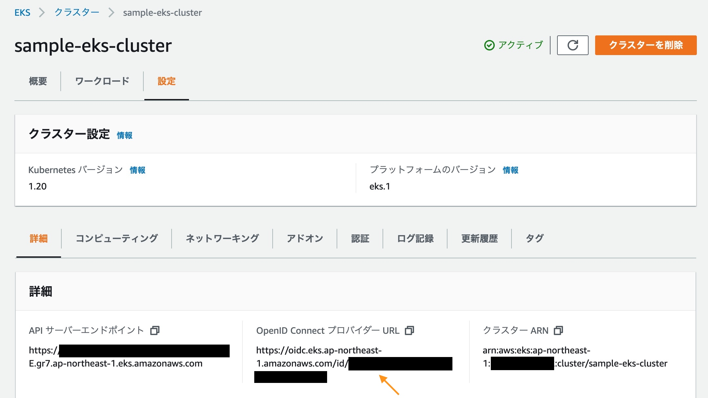
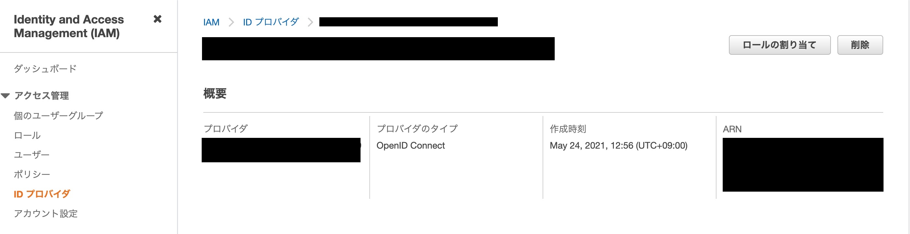

## できたこと

- [AWS Load Balancer Controller](https://kubernetes-sigs.github.io/aws-load-balancer-controller/v2.2/)を利用して ALB を作成する
- http で ALB を介して EKS クラスタへインターネット接続する

## EKS でロードバランシング

色々すっ飛ばしますが、マニフェストファイルで`type: LoadBalancer`とすると、CLB になります。
ALB(というか ELB)を使用したい場合は、AWS Load Balancer Controller を利用します。

※余談ですが、[EKS のワークショップ](https://eks-for-aws-summit-online.workshop.aws/)ではしれっと CLB です。
目的がコンテナ、Kubernetes を体感してもらうことだと理解してるので、まあいいかなと思いますが。

### AWS Load Balancer Controller の名前について

2020 年 10 月に AWS ALB Ingress Controller から名前が変わってメジャーバージョンも 2 に上がっています。ただし、まだまだ Ingress Controller で調べた方が記事が出てきます。

ちなみに、[AWS のブログ](https://aws.amazon.com/jp/blogs/containers/introducing-aws-load-balancer-controller/)いわく、この 2 つの間では後方互換が保たれているらしく、[ガイド](https://kubernetes-sigs.github.io/aws-load-balancer-controller/v2.2/deploy/upgrade/migrate_v1_v2/)も出ています。インフラは AWS で変わらないからそりゃそうか。

## クラスタへの AWS Load Balancer Controller のインストール

ここからはできたことの詳細ログを残していきます。ちなみに、同義の手順がすごくたくさんの場所にあるので、極力冒頭にある公式ドキュメントにしたがっていきます。
ちなみに、同義の手順はこの辺です。

- https://docs.aws.amazon.com/ja_jp/eks/latest/userguide/aws-load-balancer-controller.html
- https://aws.amazon.com/jp/premiumsupport/knowledge-center/eks-alb-ingress-controller-setup/
- https://docs.aws.amazon.com/ja_jp/eks/latest/userguide/alb-ingress.html

### 事前準備

- 使用する AWS 環境を固定する
  ```
  export AWS_PROFILE=
  export AWS_REGION=ap-northeast-1
  ```
- EKS クラスタがなければ作成する
  - これは[EKS のワークショップ](https://eks-for-aws-summit-online.workshop.aws/)を参考にして作成するといいと思います
- `eksctl`コマンドを使えるようにしておく

### IAM Permissions

クラスタから LB のリソースを作成するので、権限を与えてやる必要があります。

##### Create IAM OIDC provider

サービスアカウントってなんだというレベルだったのでわからなくなりました。
なんで OIDC が突如出てくるのかよく分からないが、言われるがままに。

ざっくりと理解したこと[参考 1](https://cstoku.dev/posts/2018/k8sdojo-19/)、[参考 2](https://dev.classmethod.jp/articles/eks-supports-iam-roles-for-service-accounts/)

- そもそも EKS は元々ポッド単位の IAM 制御ができなかった
- Kubernetes のサービスアカウント（ユーザ）の認証パターンの 1 つに[OIDC 認証](https://kubernetes.io/ja/docs/reference/access-authn-authz/authentication/#%E3%82%B5%E3%83%BC%E3%83%93%E3%82%B9%E3%82%A2%E3%82%AB%E3%82%A6%E3%83%B3%E3%83%88%E3%83%88%E3%83%BC%E3%82%AF%E3%83%B3)があって、2019 年に利用できるようになった
- AWS Load Balancer Controller に必要なサービスアカウントも それを使う

```zsh
yuki@taniyamayuukinoMacBook-Air ~ % eksctl utils associate-iam-oidc-provider \
    --region ap-northeast-1 \
    --cluster sample-eks-cluster \
    --approve
2021-04-23 13:23:04 [ℹ]  eksctl version 0.45.0
2021-04-23 13:23:04 [ℹ]  using region ap-northeast-1
2021-04-23 13:23:05 [ℹ]  will create IAM Open ID Connect provider for cluster "sample-eks-cluster" in "ap-northeast-1"
2021-04-23 13:23:06 [✔]  created IAM Open ID Connect provider for cluster "sample-eks-cluster" in "ap-northeast-1"
yuki@taniyamayuukinoMacBook-Air ~ %
```

多分、頑張れば AWS CLI とかでも再現できるんだろう。。。

クラスタの IDP の URL にある ID が IAM の ID プロバイダの名前になっていることが確認できるはずです（ややこしい）。



#### Download IAM policy for the AWS Load Balancer Controller

AWS Load Balancer Controller に必要なポリシーが羅列されたファイルです。

#### Create an IAM policy called AWSLoadBalancerControllerIAMPolicy

実行ログ（一部マスク）だけ。

```zsh
yuki@taniyamayuukinoMacBook-Air ~ % aws iam create-policy \
 --policy-name AWSLoadBalancerControllerIAMPolicy \
 --policy-document file://iam-policy.json
{
    "Policy": {
        "PolicyName": "AWSLoadBalancerControllerIAMPolicy",
        "PolicyId": "ANPAUZFY2NM7MGL6BYS4N",
        "Arn": "arn:aws:iam::XXXXXXXXXXXX:policy/AWSLoadBalancerControllerIAMPolicy",
        "Path": "/",
        "DefaultVersionId": "v1",
        "AttachmentCount": 0,
        "PermissionsBoundaryUsageCount": 0,
        "IsAttachable": true,
        "CreateDate": "2021-04-23T04:29:28+00:00",
        "UpdateDate": "2021-04-23T04:29:28+00:00"
    }
}
yuki@taniyamayuukinoMacBook-Air ~ %
```

#### Create a IAM role and ServiceAccount for the AWS Load Balancer controller

以下の 2 つをやってくれる。

- 前で作成されたポリシーに紐づくロールを作成
- クラスタ内にサービスアカウントを作成

```zsh
yuki@taniyamayuukinoMacBook-Air ~ % eksctl create iamserviceaccount \
--region ap-northeast-1 \
--cluster=sample-eks-cluster \
--namespace=kube-system \
--name=aws-load-balancer-controller \
--attach-policy-arn=arn:aws:iam::XXXXXXXXXXXX:policy/AWSLoadBalancerControllerIAMPolicy \
--override-existing-serviceaccounts \
--approve
2021-04-23 13:41:27 [ℹ]  eksctl version 0.45.0
2021-04-23 13:41:27 [ℹ]  using region ap-northeast-1
2021-04-23 13:41:28 [ℹ]  1 iamserviceaccount (kube-system/aws-load-balancer-controller) was included (based on the include/exclude rules)
2021-04-23 13:41:28 [!]  metadata of serviceaccounts that exist in Kubernetes will be updated, as --override-existing-serviceaccounts was set
2021-04-23 13:41:28 [ℹ]  1 task: { 2 sequential sub-tasks: { create IAM role for serviceaccount "kube-system/aws-load-balancer-controller", create serviceaccount "kube-system/aws-load-balancer-controller" } }
2021-04-23 13:41:28 [ℹ]  building iamserviceaccount stack "eksctl-sample-eks-cluster-addon-iamserviceaccount-kube-system-aws-load-balancer-controller"
2021-04-23 13:41:28 [ℹ]  deploying stack "eksctl-sample-eks-cluster-addon-iamserviceaccount-kube-system-aws-load-balancer-controller"
2021-04-23 13:41:28 [ℹ]  waiting for CloudFormation stack "eksctl-sample-eks-cluster-addon-iamserviceaccount-kube-system-aws-load-balancer-controller"
2021-04-23 13:41:44 [ℹ]  waiting for CloudFormation stack "eksctl-sample-eks-cluster-addon-iamserviceaccount-kube-system-aws-load-balancer-controller"
2021-04-23 13:42:01 [ℹ]  waiting for CloudFormation stack "eksctl-sample-eks-cluster-addon-iamserviceaccount-kube-system-aws-load-balancer-controller"
2021-04-23 13:42:02 [ℹ]  created serviceaccount "kube-system/aws-load-balancer-controller"
yuki@taniyamayuukinoMacBook-Air tech-blog-hugo %
```

下記で確認できる。Annotations のところで、作成した role がアタッチ（実質そう言っていいだろう…）されています

```zsh
yuki@taniyamayuukinoMacBook-Air ~ % kubectl describe serviceaccount  aws-load-balancer-controller -n kube-system
Name:                aws-load-balancer-controller
Namespace:           kube-system
Labels:              app.kubernetes.io/managed-by=eksctl
Annotations:         eks.amazonaws.com/role-arn: arn:aws:iam::XXXXXXXXXXXX:role/eksctl-sample-eks-cluster-addon-iamserviceac-Role1-1R8KA3F3E95W
Image pull secrets:  <none>
Mountable secrets:   aws-load-balancer-controller-token-b6v2v
Tokens:              aws-load-balancer-controller-token-b6v2v
Events:              <none>
yuki@taniyamayuukinoMacBook-Air tech-blog-hugo %
```

##### ちなみに

no task となって過去のが残っている場合

```zsh
2021-05-10 15:44:17 [ℹ]  eksctl version 0.45.0
2021-05-10 15:44:17 [ℹ]  using region ap-northeast-1
2021-05-10 15:44:19 [ℹ]  1 existing iamserviceaccount(s) (kube-system/aws-load-balancer-controller) will be excluded
2021-05-10 15:44:19 [ℹ]  1 iamserviceaccount (kube-system/aws-load-balancer-controller) was excluded (based on the include/exclude rules)
2021-05-10 15:44:19 [!]  metadata of serviceaccounts that exist in Kubernetes will be updated, as --override-existing-serviceaccounts was set
2021-05-10 15:44:19 [ℹ]  no tasks
```

`eksctl`の不具合なのだろうか、ゴミが残っている。[これ](https://github.com/weaveworks/eksctl/issues/1497#issuecomment-607925740)に従って、まずは削除しておく。環境削除する際も、この手順相当のものをしておいた方が良さそう。

```zsh
yuki@taniyamayuukinoMacBook-Air ~ % eksctl delete iamserviceaccount \
--region ap-northeast-1 \
--cluster=sample-eks-cluster \
--namespace=kube-system \
--name=aws-load-balancer-controller \
2021-05-10 15:46:15 [ℹ]  eksctl version 0.45.0
2021-05-10 15:46:15 [ℹ]  using region ap-northeast-1
2021-05-10 15:46:16 [ℹ]  1 iamserviceaccount (kube-system/aws-load-balancer-controller) was included (based on the include/exclude rules)
2021-05-10 15:46:16 [ℹ]  1 task: { 2 sequential sub-tasks: { delete IAM role for serviceaccount "kube-system/aws-load-balancer-controller" [async], delete serviceaccount "kube-system/aws-load-balancer-controller" } }
2021-05-10 15:46:17 [ℹ]  will delete stack "eksctl-sample-eks-cluster-addon-iamserviceaccount-kube-system-aws-load-balancer-controller"
2021-05-10 15:46:17 [ℹ]  serviceaccount "kube-system/aws-load-balancer-controller" was already deleted
yuki@taniyamayuukinoMacBook-Air ~ %
```

### Add Controller to Cluster

下準備ができたので、Controller を追加します。

#### Install cert-manager

その名の通りなのだろうが、言われるがままにやってみる。

```zsh
yuki@taniyamayuukinoMacBook-Air ~ % kubectl apply --validate=false -f https://github.com/jetstack/cert-manager/releases/download/v1.0.2/cert-manager.yaml
customresourcedefinition.apiextensions.k8s.io/certificaterequests.cert-manager.io created
customresourcedefinition.apiextensions.k8s.io/certificates.cert-manager.io created
customresourcedefinition.apiextensions.k8s.io/challenges.acme.cert-manager.io created
customresourcedefinition.apiextensions.k8s.io/clusterissuers.cert-manager.io created
customresourcedefinition.apiextensions.k8s.io/issuers.cert-manager.io created
customresourcedefinition.apiextensions.k8s.io/orders.acme.cert-manager.io created
namespace/cert-manager created
serviceaccount/cert-manager-cainjector created
serviceaccount/cert-manager created
serviceaccount/cert-manager-webhook created
clusterrole.rbac.authorization.k8s.io/cert-manager-cainjector created
clusterrole.rbac.authorization.k8s.io/cert-manager-controller-issuers created
clusterrole.rbac.authorization.k8s.io/cert-manager-controller-clusterissuers created
clusterrole.rbac.authorization.k8s.io/cert-manager-controller-certificates created
clusterrole.rbac.authorization.k8s.io/cert-manager-controller-orders created
clusterrole.rbac.authorization.k8s.io/cert-manager-controller-challenges created
clusterrole.rbac.authorization.k8s.io/cert-manager-controller-ingress-shim created
clusterrole.rbac.authorization.k8s.io/cert-manager-view created
clusterrole.rbac.authorization.k8s.io/cert-manager-edit created
clusterrolebinding.rbac.authorization.k8s.io/cert-manager-cainjector created
clusterrolebinding.rbac.authorization.k8s.io/cert-manager-controller-issuers created
clusterrolebinding.rbac.authorization.k8s.io/cert-manager-controller-clusterissuers created
clusterrolebinding.rbac.authorization.k8s.io/cert-manager-controller-certificates created
clusterrolebinding.rbac.authorization.k8s.io/cert-manager-controller-orders created
clusterrolebinding.rbac.authorization.k8s.io/cert-manager-controller-challenges created
clusterrolebinding.rbac.authorization.k8s.io/cert-manager-controller-ingress-shim created
role.rbac.authorization.k8s.io/cert-manager-cainjector:leaderelection created
role.rbac.authorization.k8s.io/cert-manager:leaderelection created
role.rbac.authorization.k8s.io/cert-manager-webhook:dynamic-serving created
rolebinding.rbac.authorization.k8s.io/cert-manager-cainjector:leaderelection created
rolebinding.rbac.authorization.k8s.io/cert-manager:leaderelection created
rolebinding.rbac.authorization.k8s.io/cert-manager-webhook:dynamic-serving created
service/cert-manager created
service/cert-manager-webhook created
deployment.apps/cert-manager-cainjector created
deployment.apps/cert-manager created
deployment.apps/cert-manager-webhook created
mutatingwebhookconfiguration.admissionregistration.k8s.io/cert-manager-webhook created
validatingwebhookconfiguration.admissionregistration.k8s.io/cert-manager-webhook created
yuki@taniyamayuukinoMacBook-Air tech-blog-hugo %
```

#### Apply YAML

インストールしたい Controller のバージョンをインストールして利用します。
公式がなぜか wget で書いていたので、v2.2 の場合の curl を書きました。

```zsh
curl -o v2_2_0_full.yaml https://raw.githubusercontent.com/kubernetes-sigs/aws-load-balancer-controller/v2.2.0/docs/install/v2_2_0_full.yaml
```

何も考えずにやると…

```zsh
yuki@taniyamayuukinoMacBook-Air ~ % kubectl apply -f [yamlファイル名].yaml
Warning: apiextensions.k8s.io/v1beta1 CustomResourceDefinition is deprecated in v1.16+, unavailable in v1.22+; use apiextensions.k8s.io/v1 CustomResourceDefinition
customresourcedefinition.apiextensions.k8s.io/targetgroupbindings.elbv2.k8s.aws created
Warning: admissionregistration.k8s.io/v1beta1 MutatingWebhookConfiguration is deprecated in v1.16+, unavailable in v1.22+; use admissionregistration.k8s.io/v1 MutatingWebhookConfiguration
mutatingwebhookconfiguration.admissionregistration.k8s.io/aws-load-balancer-webhook created
Warning: kubectl apply should be used on resource created by either kubectl create --save-config or kubectl apply
serviceaccount/aws-load-balancer-controller configured
role.rbac.authorization.k8s.io/aws-load-balancer-controller-leader-election-role created
clusterrole.rbac.authorization.k8s.io/aws-load-balancer-controller-role created
rolebinding.rbac.authorization.k8s.io/aws-load-balancer-controller-leader-election-rolebinding created
clusterrolebinding.rbac.authorization.k8s.io/aws-load-balancer-controller-rolebinding created
service/aws-load-balancer-webhook-service created
deployment.apps/aws-load-balancer-controller created
certificate.cert-manager.io/aws-load-balancer-serving-cert created
issuer.cert-manager.io/aws-load-balancer-selfsigned-issuer created
Warning: admissionregistration.k8s.io/v1beta1 ValidatingWebhookConfiguration is deprecated in v1.16+, unavailable in v1.22+; use admissionregistration.k8s.io/v1 ValidatingWebhookConfiguration
validatingwebhookconfiguration.admissionregistration.k8s.io/aws-load-balancer-webhook created
yuki@taniyamayuukinoMacBook-Air ~ %
```

> serviceaccount/aws-load-balancer-controller configured

これがダメだった。。。「Create a IAM role and ServiceAccount for the AWS Load Balancer controller」で設定できているので、[この項目](https://github.com/kubernetes-sigs/aws-load-balancer-controller/blob/v2.2.0/docs/install/v2_2_0_full.yaml#L545-L554)自体消してねっていうガイドだった。（わかりにくい気がするんだが・・・私の未知ですけど）

確認方法はこちら

```zsh
yuki@taniyamayuukinoMacBook-Air ~ % kubectl get pods -n kube-system
NAME                                            READY   STATUS    RESTARTS   AGE
aws-load-balancer-controller-6bf9d8785f-mc8l2   1/1     Running   0          9m11s
aws-node-7nmcr                                  1/1     Running   0          7d19h
aws-node-jq44d                                  1/1     Running   0          7d19h
coredns-59847d77c8-7zrgq                        1/1     Running   0          45h
coredns-59847d77c8-d2vd9                        1/1     Running   0          45h
kube-proxy-scp6s                                1/1     Running   0          7d19h
kube-proxy-sz6l5                                1/1     Running   0          7d19h
yuki@taniyamayuukinoMacBook-Air ~ %
```

## サンプルアプリの実行

2048 のサンプルアプリを実行します

```zsh
kubectl apply -f https://github.com/kubernetes-sigs/aws-load-balancer-controller/blob/v2.2.0/docs/examples/2048/2048_full.yaml
```

Controller のログはこれで見れます。

```zsh
kubectl logs -n kube-system   deployment.apps/aws-load-balancer-controller
```

ちなみに、私の場合はこんなエラーが出ました。

```zsh
{"level":"error","ts":1619164933.0124931,"logger":"controller","msg":"Reconciler error","controller":"ingress","name":"ingress-2048","namespace":"game-2048","error":"couldn't auto-discover subnets: unable to discover at least one subnet"}
{"level":"error","ts":1619164933.0668545,"logger":"controller","msg":"Reconciler error","controller":"ingress","name":"ingress-2048","namespace":"game-2048","error":"couldn't auto-discover subnets: unable to discover at least one subnet"}
{"level":"error","ts":1619164933.1218274,"logger":"controller","msg":"Reconciler error","controller":"ingress","name":"ingress-2048","namespace":"game-2048","error":"couldn't auto-discover subnets: unable to discover at least one subnet"}
{"level":"error","ts":1619164934.081636,"logger":"controller","msg":"Reconciler error","controller":"ingress","name":"ingress-2048","namespace":"game-2048","error":"couldn't auto-discover subnets: unable to discover at least one subnet"}
{"level":"error","ts":1619164934.1776323,"logger":"controller","msg":"Reconciler error","controller":"ingress","name":"ingress-2048","namespace":"game-2048","error":"couldn't auto-discover subnets: unable to discover at least one subnet"}
{"level":"error","ts":1619164934.324311,"logger":"controller","msg":"Reconciler error","controller":"ingress","name":"ingress-2048","namespace":"game-2048","error":"couldn't auto-discover subnets: unable to discover at least one subnet"}
{"level":"error","ts":1619164935.147187,"logger":"controller","msg":"Reconciler error","controller":"ingress","name":"ingress-2048","namespace":"game-2048","error":"couldn't auto-discover subnets: unable to discover at least one subnet"}
{"level":"error","ts":1619164935.5123303,"logger":"controller","msg":"Reconciler error","controller":"ingress","name":"ingress-2048","namespace":"game-2048","error":"couldn't auto-discover subnets: unable to discover at least one subnet"}
{"level":"error","ts":1619164936.194994,"logger":"controller","msg":"Reconciler error","controller":"ingress","name":"ingress-2048","namespace":"game-2048","error":"couldn't auto-discover subnets: unable to discover at least one subnet"}
{"level":"error","ts":1619164937.5282407,"logger":"controller","msg":"Reconciler error","controller":"ingress","name":"ingress-2048","namespace":"game-2048","error":"couldn't auto-discover subnets: unable to discover at least one subnet"}
{"level":"error","ts":1619164940.137434,"logger":"controller","msg":"Reconciler error","controller":"ingress","name":"ingress-2048","namespace":"game-2048","error":"couldn't auto-discover subnets: unable to discover at least one subnet"}
{"level":"error","ts":1619164945.4638603,"logger":"controller","msg":"Reconciler error","controller":"ingress","name":"ingress-2048","namespace":"game-2048","error":"couldn't auto-discover subnets: unable to discover at least one subnet"}
{"level":"error","ts":1619164955.752866,"logger":"controller","msg":"Reconciler error","controller":"ingress","name":"ingress-2048","namespace":"game-2048","error":"couldn't auto-discover subnets: unable to discover at least one subnet"}
{"level":"error","ts":1619164976.278661,"logger":"controller","msg":"Reconciler error","controller":"ingress","name":"ingress-2048","namespace":"game-2048","error":"couldn't auto-discover subnets: unable to discover at least one subnet"}
{"level":"error","ts":1619165017.5180373,"logger":"controller","msg":"Reconciler error","controller":"ingress","name":"ingress-2048","namespace":"game-2048","error":"couldn't auto-discover subnets: unable to discover at least one subnet"}
```

サブネットが見つかんないと言われてますね。

StackOverflow を調べると…
https://stackoverflow.com/questions/66039501/eks-alb-is-not-to-able-to-auto-discover-subnets

[公式ドキュメント](https://kubernetes-sigs.github.io/aws-load-balancer-controller/v2.2/deploy/subnet_discovery/)にもちゃんと書かれてました。
サブネットへのタギングをしないとダメみたいです。今回は internet-facing なので、少なくともパブリックサブネットに`kubernetes.io/role/elb`のタグ付けが必要です。

この辺を乗り越えて、2048 を楽しめました。

## 参考サイト

- [【初心者】Amazon EKS を使ってみる #3 (AWS Load Balancer Controller による Ingress の利用)](https://qiita.com/mksamba/items/c0e41a2a63e62a50aea3)
  - 同じように HTTP 接続ができるところまでがゴール
- [ALB で gRPC を利用する on EKS](https://www.blogaomu.com/entry/alb-grpc-on-eks)
  - gRPC 通信は HTTPS のみなので、それに関連した作業が必要になります。
