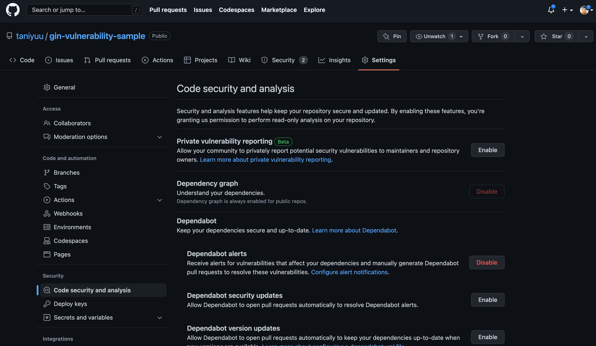
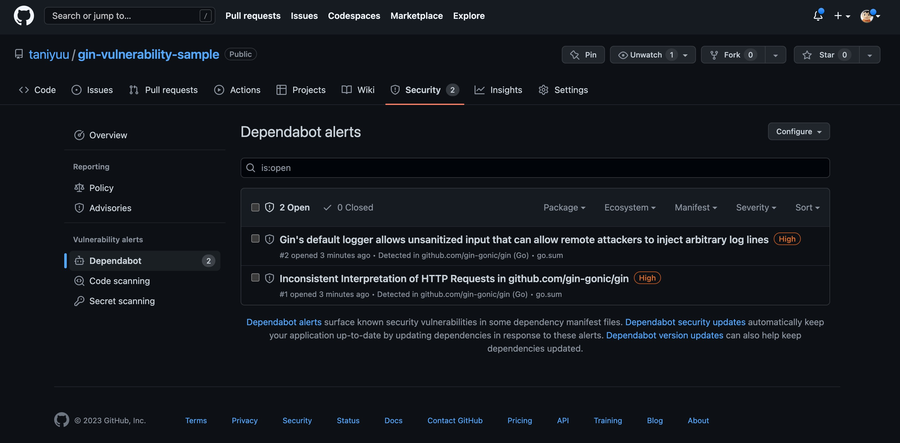
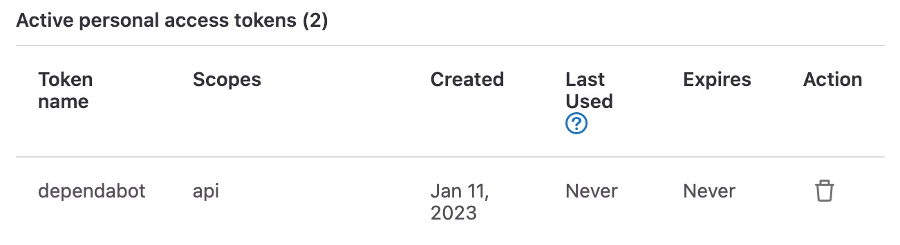
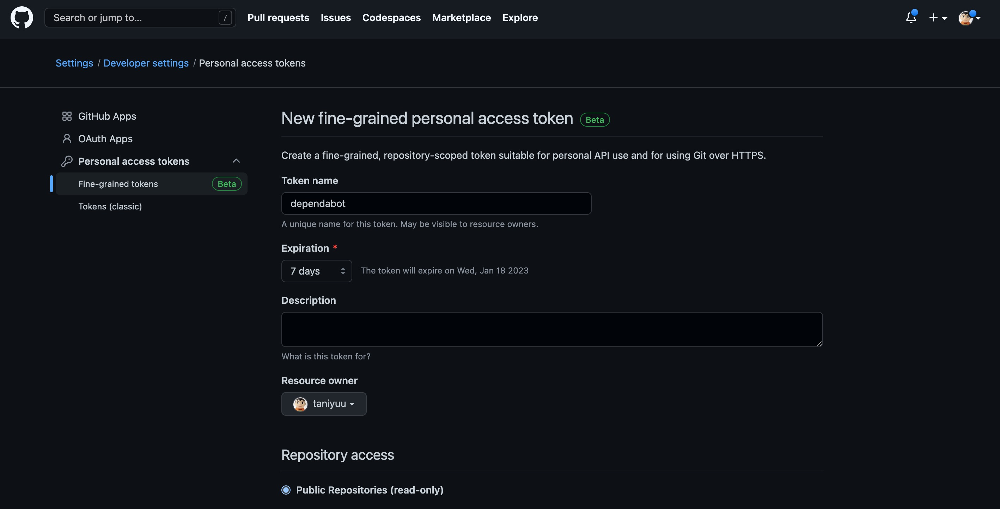
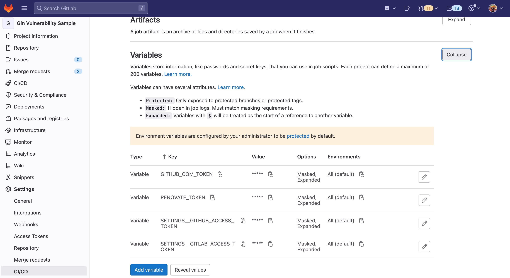

### これはなに
脆弱性レポートって、GitHubは（パブリックなら特に）簡単に出てくるけど、
仕事上はGitLab使うことが多いので、同じことができないか調べてみました。


### 実験対象
golangでginのバージョンが古いコードを作って、レポートが出てくる条件を発生させました。

CVEレポート
https://www.cvedetails.com/vulnerability-list/vendor_id-24141/product_id-91039/Gin-gonic-GIN.html


### GitHub

ベースラインとなる脆弱性レポートをDependabotを使って出してみます。
DependabotさんはGitHubに買収されたようで、いつの間にかGitHubのサービスと化しているんですね。

なお、今回は一番簡単なパブリックリポジトリで作成した場合です。

1. GitHubにリポジトリ作成
1. Settings > Code security and analysis > Dependabot から好きなものをEnableへ変更 今回はalertsだけにしてPRは出しませんでした 
1. 出来上がり 今回は Security > Vulnerability alerts > Dependabot に出ました 


### 本題その１：dependabot-gitlab
有志（Dependabotとは関連しない第三者的な意味合いだと思われる）が、GitLabでもDependabotを使えるように作ってくれているものを使います。

Helm、Docker Composeの次に書いてある、Standaloneを使えば、GitLab CIに組み込めます。
（っていうか、前者2種の使い方する人いるの？？）
https://dependabot-gitlab.gitlab.io/dependabot/guide/deploy.html#standalone

#### 設定

ページとしては戻るんですが・・・GitLabのアクセストークンとGitHubのアクセストークンが必要です。
https://dependabot-gitlab.gitlab.io/dependabot/guide/getting-started.html#step-2-set-up-access-tokens

GitLab



GitHub（なんかFine-grained personal access tokensなるものができてたのでそっちで作りましたが、無期限にできなかった）


CIの変数として、どこかしらに保存しておきましょう。普通は Settings > CI/CDに記載しておけばジョブのログでもマスキングしてくれますね。

紆余曲折あり、最終的に動いたジョブ
https://gitlab.com/taniyuu/gin-vulnerability-sample/-/jobs/3585304097

CIファイル抜粋
```yaml
gomod:
  extends: .dependabot-gitlab
  variables:
    PROJECT_PATH: "$CI_PROJECT_NAMESPACE/$CI_PROJECT_NAME"
    DIRECTORY: "/"
    PACKAGE_MANAGER_SET: gomod
  rules:
    - if: $DEPENDENCY_UPDATES_DISABLED
      when: never
    - if: '$CI_PIPELINE_SOURCE == "schedule" && $PACKAGE_MANAGER_SET =~ /\bgomod\b/'
```

ポイントは`PACKAGE_MANAGER_SET` です。
[package-ecosystem](https://docs.github.com/en/code-security/dependabot/dependabot-version-updates/configuration-options-for-the-dependabot.yml-file#package-ecosystem)のところで記載されている、パッケージマネージャーを羅列します。

今回はgoのライブラリ管理に使っている`gomod`にしました。あとは`gradle`とか`npm`とか`terraform`まであるんですね。

#### 結果

ジョブが動くと、Merge Requestが作成されました。書いてあることはGitHubのPRの場合とほぼ、というか同一ですかね。
https://gitlab.com/taniyuu/gin-vulnerability-sample/-/merge_requests/1


### 本題その2：renovate

脆弱性、という話からは逸れる気がしますが、とりあえずバージョン上げときゃいいんじゃね？っていうのにはこれがいい気がします。
一応公式サイトも上げておきますが、全然中身見てないです。笑
https://www.mend.io/free-developer-tools/renovate/

そのうちのGitLab関連のドキュメントを漁りつつ先ほどと同じようなことをやってみます。
https://docs.renovatebot.com/getting-started/running/#gitlab-runner
https://gitlab.com/renovate-bot/renovate-runner/


#### 設定
アクセストークンは先ほどと同じセットが必要です。
別名になるので`GITHUB_COM_TOKEN`と`RENOVATE_TOKEN`に定義し直しました。



紆余曲折あり、最終的に動いたジョブ
https://gitlab.com/taniyuu/gin-vulnerability-sample/-/jobs/3587186705

CIファイル抜粋
```yaml
renovate:
  stage: test
  variables:
    RENOVATE_REQUIRE_CONFIG: optional
    RENOVATE_ENABLED_MANAGERS: gomod
    GOPROXY: "https://proxy.golang.org"
  script:
    - renovate $CI_PROJECT_NAMESPACE/$CI_PROJECT_NAME
```

gomod固有の設定で躓きましたが、こちらもプリセットがあるおかげでだいぶスリムに書けました。
`RENOVATE_REQUIRE_CONFIG`は、一言でいうと詳細設定を別ファイルに置くか、みたいな設定で、今回は端折りたかったので`optional`にしています。
https://docs.renovatebot.com/self-hosted-configuration/#requireconfig

#### 結果

こちらも、Merge Requestが作成されました。
https://gitlab.com/taniyuu/gin-vulnerability-sample/-/merge_requests/2

### 考察

細かい設定のところで両方ともカスタマイズ性あると思うので、デフォルトの場合こうだったよ、くらいのまとめです。

各モジュールの場合の話になるのですが、gomodの場合は行が増える方向にしか追加されていないのが特徴的ですね。
なんとなくtidyされていて欲しいので、Dependabotの方が綺麗です。

他方MRの内容はrenovateが丁寧でした。どれだけ見るんだって話はありそうですが。


### お金があるなら
GitLabに1人$99払えばリッチなエクスペリエンスが得られますよ。
https://docs.gitlab.com/ee/user/application_security/vulnerability_report/

### セルフホスティングは
頑張ってください。ただ、基本的には上記の方法は通用すると思います。
それがGitLab CIの真のうまみかもしれない・・・
